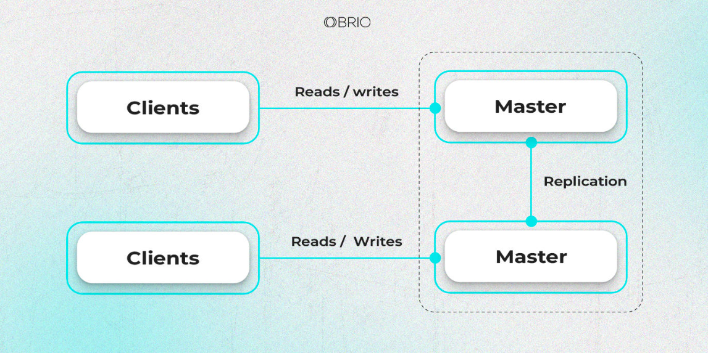
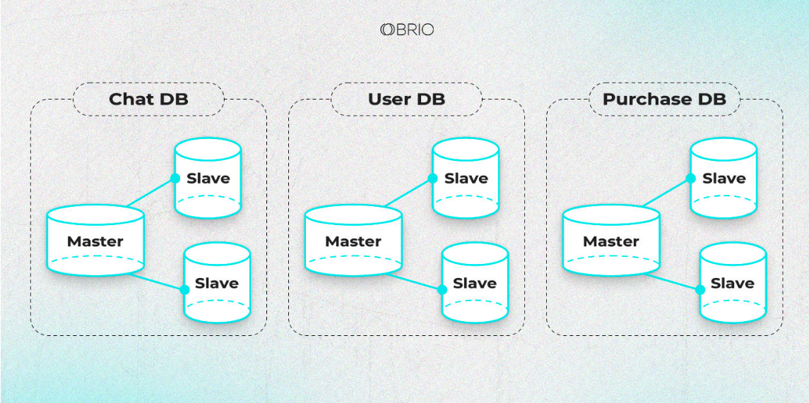
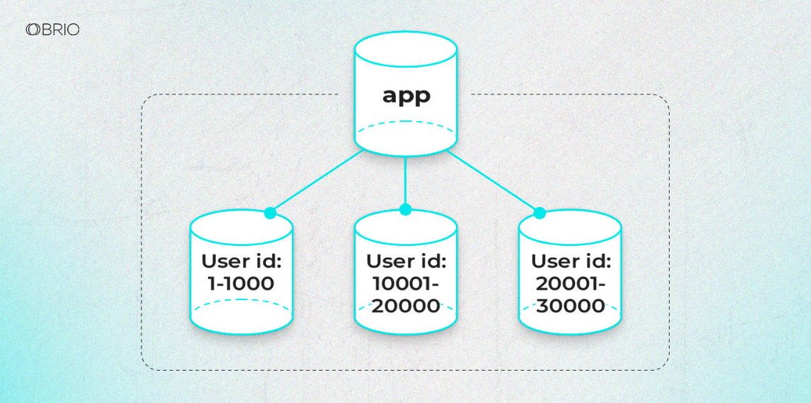
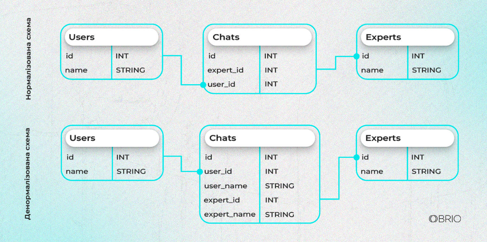
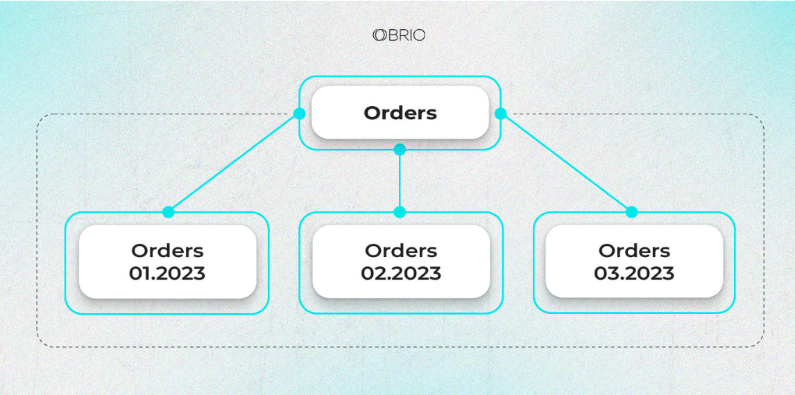

# Методи масштабування реляційних баз даних

Масштабування реляційних баз даних грає важливу роль у забезпеченні продуктивності та доступності систем з великою навантаженістю. Існує кілька підходів до цього: реплікація Master/Slave та Master/Master, функціональне та горизонтальне партиціювання, шардинг, денормалізація. У цій статі я хочу Вам розповісти про переваги та недоліки кожного цього підходу. Також розповім нюанси та наведу кейси використання, коли вони будуть працювати якнайкраще.

## Реплікація 

Реплікація в базі даних - це процес створення та підтримки копій даних з одного джерела на інших місцях. Це може бути корисним для забезпечення високої доступності та підвищення продуктивності. Існують різні види реплікації, такі як Master/Slave (одне головне джерело, багато копій), Master/Master (декілька джерел, які можуть приймати та змінювати дані), та інші.

### Master/Slave

Метод Master/Slave в контексті баз даних передбачає існування одного головного джерела (Master), яке має основний набір даних, і кількох слуг (Slave), які мають копії цих даних і синхронізуються з мастером. Мастер відповідає за запис даних, тоді як слейви використовуються для читання або резервних копій. Цей підхід може полегшити навантаження на мастера, оскільки читання можна розподілити між кількома слейвами. Проте, це також може виникнути питання синхронізації між мастером і слейвами, а також управлінням конфліктами даних у випадку одночасних змін.

Уявіть магазин електроніки з онлайн-магазином та фізичними магазинами. Основна база даних знаходиться в центральному офісі (Master), але дані про товари, клієнтів, замовлення та запаси потрібні і в фізичних магазинах. Кожен магазин може мати свою локальну копію цих даних (Slave), які регулярно синхронізуються з центральною базою.

Коли клієнт робить покупку в онлайн-магазині, дані про замовлення зберігаються у центральній базі даних (Master), а фізичні магазини можуть отримати цю інформацію через синхронізацію зі слейвами. Таким чином, клієнти можуть перевірити наявність товару в найближчому магазині, оскільки дані про запаси також синхронізуються між магазинами та центральною базою.

Це дозволяє магазинам оперативно взаємодіяти зі своїми клієнтами та мається на увазі, що зміни, які відбуваються в будь-якому місці (онлайн чи фізичний магазин), відображаються в центральній базі даних та інших місцях завдяки реплікації Master/Slave.

|  Переваги                                                                                                                                      |   Недоліки  |
| -----------                                                                                                                                    | ----------- | 
| **Висока доступність:** Через те, що читання може розподілятись між кількома слейвами, цей метод забезпечує швидкий доступ до даних для читання.| **Одноманітність даних:** Існує можливість, що під час синхронізації деякі дані на слейвах можуть відрізнятися від мастера, що може призвести до втрати консистентності.           |
| **Резервне копіювання:** Слейви можуть служити як резервні копії, дозволяючи відновити дані у випадку втрати основної бази.                     | **Витрати на обслуговування:** Підтримка і управління кількома копіями даних (Slave) може потребувати додаткових зусиль і ресурсів.          |
| **Розподіл навантаження:** Можливість розподілу навантаження на читання дозволяє зменшити навантаження на мастер для операцій запису.          |             |
| **Простота налаштування:** порівняно з Master/Master реплікацією, Master/Slave є простішою в налаштуванні та управлінні.                       |             |
| Конфлікти відсутні завдяки тому, що тільки один сервер бази даних (Master) обробляє та здійснює записи.                                        |             |

### Master/Master

Master/Master архітектура баз даних означає наявність кількох серверів (мастерів), які мають право на запис та зміну даних. Це означає, що кожен має здатність приймати та виконувати як операції читання, так і запису даних. Такий підхід може бути корисним для забезпечення високої доступності та витривалості системи. Проте, він потребує уважного управління конфліктами та синхронізацією даних між мастерами, оскільки одні й ті ж дані можуть змінюватись на різних серверах у той самий час.

Уявіть ситуацію з системою онлайн-аукціону, де кілька серверів баз даних працюють у режимі Master/Master.

Кожен з цих серверів баз даних має можливість приймати та обробляти пропозиції та ставки в реальному часі від користувачів. Наприклад, якщо один користувач робить ставку на певний лот, ця інформація має бути оновлена на всіх серверах, щоб уникнути перескочення ставок.

У такій системі, якщо обидва сервери можуть приймати та обробляти ставки, то користувачі можуть брати участь у торгах та робити ставки як на одному сервері, так і на іншому. Синхронізація між цими серверами є ключовою, щоб забезпечити консистентність даних, уникнути перескочення ставок та зберегти цілісність процесу торгівлі.

|  Переваги                                                                          |   Недоліки  |
| -----------                                                                        | ----------- | 
| **Висока доступність:** Кожен сервер може приймати запити, що забезпечує високий рівень доступності системи. Якщо один сервер вийде з ладу, інший може продовжувати обробку запитів. | **Конфлікти при записі:** Одночасні зміни на різних серверах можуть призвести до конфліктів при синхронізації даних, що потребує уважного управління конфліктами та розв'язання проблем з цілісністю даних.   |
| **Розділення навантаження:** Навантаження на операції запису та читання може бути розподілене між серверами, що дозволяє оптимізувати використання ресурсів. | **Синхронізація та консистентність:** Забезпечення консистентності даних між серверами є складним завданням, і неправильна синхронізація може призвести до втрати консистентності.   |
| **Скалінг:** Ця архітектура може бути легше масштабована горизонтально, додаючи нові сервери для збільшення продуктивності та витривалості. | **Складність налаштування та підтримки:** Налаштування та управління Master/Master конфігурацією може бути складним завданням, вимагаючи високого рівня експертизи для оптимального функціонування системи.   |
|                                                                                                                                       | **Безпека:** декілька серверів баз даних можуть вносити зміни в дані, це може збільшити потенційні напрямки для атак.  |

Спільні недоліки реплікації для Master/Slave і Master/Master: 

### Функціональне партиціювання

Функціональне партиціювання - це стратегія, коли дані розділяються на частини (партиції) відповідно до функцій, які вони виконують або за допомогою конкретного критерію розподілу. Цей підхід дозволяє оптимізувати роботу з великими обсягами даних шляхом розділення їх на менші і більш керовані частини.

Функціональне партиціювання може бути застосоване до різних компонентів даних: можливо, розділити дані за часом, регіоном, типом користувачів чи іншими параметрами, що дозволяє підвищити продуктивність та масштабованість системи.

Цей підхід дозволяє оптимізувати запити та операції для кожної партиції, зменшуючи навантаження на кожну окрему частину бази даних та полегшуючи роботу з ними.

Звичайний приклад функціонального партиціювання можна побачити в системі управління користувачами. Допустимо, у великій системі соціальних мереж є мільйони користувачів з різних регіонів світу.

Функціональне партиціювання може бути використане для розділення користувачів за регіонами. Дані про користувачів з Азії можуть бути збережені в одній частині бази даних, тоді як дані європейських користувачів - в іншій. Це розділення дозволяє оптимізувати роботу з даними для конкретного регіону: запити, пов'язані з користувачами з певної частини світу, обробляються локально відносно цієї частини бази даних.

Такий підхід дозволяє зменшити час відповіді на запити, оскільки дані про користувачів можуть бути розподілені на різні сервери в залежності від їхнього місця проживання. Також це полегшує масштабування системи, оскільки можна легко додавати чи видаляти сервери, що відповідають за конкретні регіони, в залежності від зростання користувацької бази

|  Переваги                                                                          |   Недоліки  |
| -----------                                                                        | ----------- | 
| **Підвищена продуктивність:** Розділення даних за функціональними або логічними критеріями дозволяє оптимізувати запити та операції для кожної партиції, зменшуючи час відповіді на запити. | **Складність управління:** Розділення даних може зробити управління системою більш складним, оскільки потребує уваги до організації та управління кожною партицією.   |
| **Ефективне управління обсягами даних:** Функціональне партиціювання спрощує роботу з великими обсягами даних, дозволяючи розділити їх на менші та керовані частини.  | **Ризик втрати консистентності:** Розділення даних може призвести до складнощів у забезпеченні консистентності між різними частинами бази даних, що може призвести до проблем з цілісністю та узгодженістю даних. |
| **Збільшення масштабованості системи:** Дозволяє легко масштабувати систему, додаючи нові партиції або сервери для збільшення продуктивності. | **Потреба у додаткових ресурсах:** Для ефективної роботи з розділеними даними може знадобитися більше ресурсів на управління та підтримку інфраструктури бази даних.|

### Шардинг

Шардинг - це метод розділення та розподілу даних на різні фізичні сервери або шарди в залежності від заданого критерію. Кожен шард містить певну частину даних і виконує певну частину роботи. Цей підхід дозволяє розміщувати дані в окремих групах, що дозволяє оптимізувати доступ до них та підвищити продуктивність системи.

Шардинг може бути здійснений за різними критеріями, такими як регіон, тип користувачів, або будь-якою іншою характеристикою, яка дозволяє розподілити дані на окремі сервери.

Цей метод дозволяє підвищити продуктивність та масштабованість системи, оскільки завдяки розділенню навантаження між шардами можна оптимізувати роботу з даними та реалізувати горизонтальне масштабування.

Задумаймо систему електронної комерції з великою кількістю користувачів та продуктів. Щоб оптимізувати роботу з даними, база даних може бути розділена за допомогою шардингу.

Наприклад, уявімо, що база даних магазину розділена за регіонами. Кожен шард може містити дані про продукти, замовлення та користувачів, які належать до конкретного регіону.

Таким чином, у базі даних можуть бути окремі шарди для різних географічних областей або країн, де магазин працює. Кожен шард містить дані лише для певної території, що дозволяє оптимізувати запити та роботу з даними для конкретного регіону без зайвого завантаження всієї бази даних.

Це полегшує доступ до даних, оскільки запити виконуються на шарді, що містить необхідну інформацію для конкретного регіону, зменшуючи навантаження на окремі шарди та поліпшуючи продуктивність системи для кожного регіону окремо.

|  Переваги                                                                          |   Недоліки  |
| -----------                                                                        | ----------- | 
| **Підвищена продуктивність:** Шардинг дозволяє розділити дані на окремі частини, що сприяє оптимізації роботи з даними, зменшенню навантаження та поліпшенню продуктивності системи. | **Складність управління:** Управління різними шардами та даними може стати складним завданням, вимагаючи додаткового уваги до синхронізації та керування розділеними даними. |
| **Масштабованість:** Шардинг дозволяє системі легко масштабуватися, додавати нові шарди для обробки більшого обсягу даних та підвищення продуктивності. | **Ризик втрати консистентності:** Підтримка консистентності даних між різними шардами може бути викликана складністю та вимогами синхронізації, що може призвести до проблем з цілісністю та узгодженістю даних. |
| **Локалізований доступ:** Кожен шард містить певну частину даних, що сприяє швидкому доступу до локальних даних, зменшуючи час відповіді на запити. | **Витрати на ресурси:** Розподілена архітектура може вимагати більше ресурсів для управління та підтримки інфраструктури, зокрема управління кожним шардом та його даними. |

### Денормалізація

Денормалізація - це процес зведення декількох нормалізованих таблиць у одну або кілька менш нормалізованих структур для полегшення та покращення продуктивності запитів. Це робиться для спрощення структури даних та оптимізації читання даних без значного втручання в цілісність бази даних.

Звичайний приклад денормалізації можна побачити в системі управління продуктами та їх замовленнями.

У нормалізованій базі даних може бути дві таблиці: одна зберігає дані про продукти (назва, опис, ціна тощо), інша - дані про замовлення (клієнт, дата, кількість тощо), причому вони пов'язані за допомогою ідентифікаторів.

У денормалізованій структурі можливо об'єднати ці таблиці. Таким чином, денормалізована таблиця може містити не лише дані про замовлення, а й певні дані про продукти, наприклад, назву та ціну продукту, що був замовлений. Це дозволяє отримати всю необхідну інформацію з однієї таблиці, що спрощує запити та полегшує роботу з даними, особливо у випадку частих запитів на дані про замовлення та їх відповідні продукти.

|  Переваги                                                                          |   Недоліки  |
| -----------                                                                        | ----------- | 
| **Покращена продуктивність запитів:** Денормалізація може спростити запити до бази даних, оскільки деякі дані можуть бути збережені в одній таблиці. Це зменшує необхідність виконання складних операцій з'єднання таблиць та поліпшує швидкість виконання запитів. | **Ризик втрати цілісності даних:** Денормалізація може призвести до дублювання даних та зростання ризику втрати цілісності та консистентності даних, оскільки одні й ті ж самі дані можуть бути збережені в кількох місцях.   |
| **Покращена продуктивність для читання даних:** Запити на читання даних можуть бути більш ефективними, оскільки вони можуть працювати з меншою кількістю таблиць, що сприяє швидшому доступу до інформації.  | **Складніше управління даними:** Збільшення кількості дубльованих даних може зробити управління та підтримку бази даних більш складними та вимагати додаткових зусиль для забезпечення їхньої цілісності.  |
| **Спрощення структури даних:** Денормалізація може спростити модель даних, зменшуючи кількість таблиць та складних зв'язків між ними. | **Збільшення об'єму даних:** Денормалізація може призвести до збільшення об'єму даних в базі, оскільки деякі дані будуть дубльовані, що може вплинути на вимоги до обсягу сховища та продуктивності. |

### Горизонтальне партиціювання

Горизонтальне партиціювання - це стратегія розділення таблиці на частини за рядками, тобто по горизонталі. Дані розділяються на декілька фізичних частин, де кожна частина містить певний діапазон рядків з вихідної таблиці.

Цей метод дозволяє розподілити дані таблиці по рядках між різними фізичними ресурсами або серверами. Зазвичай горизонтальне партиціювання використовується для розподілу даних за допомогою ключів або критеріїв, таких як ідентифікатори користувачів, дати або інших характеристик.

Цей підхід дозволяє полегшити роботу з великими обсягами даних, оскільки можна розділити навантаження між різними серверами та забезпечити більш ефективний доступ до даних, особливо при великому обсязі однотипних операцій.

Проте, варто враховувати, що горизонтальне партиціювання може стати складним при виконанні операцій, які потребують обробки даних з різних частин таблиці, а також вимагає уваги до збереження цілісності даних між різними частинами.

Уявімо базу даних інтернет-магазину з великою кількістю замовлень. Ця база даних містить таблицю "Замовлення" з даними про всі замовлення користувачів.

Для горизонтального партиціювання цієї таблиці можна використовувати розподіл за датою створення замовлення. Наприклад, дані можуть бути розділені таким чином, що кожен сервер або шард містить дані за певний період часу, наприклад, за місяць або квартал. Тобто, таблиця "Замовлення" розподілена на частини, де кожна частина містить дані лише за певний період.

Це дозволяє ефективно керувати обсягами даних, оскільки нові замовлення будуть зберігатися на відповідному сервері або шарді, тоді як старі дані будуть зберігатися окремо. При такому розподілі можна забезпечити ефективний доступ до інформації про замовлення за певний період часу без зайвого навантаження на одну базу даних.

|  Переваги                                                                          |   Недоліки  |
| -----------                                                                        | ----------- | 
| **Масштабованість:** Горизонтальне партиціювання дозволяє легко масштабувати систему, додаючи нові сервери або шарди для обробки більшого обсягу даних, збільшуючи тим самим продуктивність.| **Складність обробки запитів:** Операції, які вимагають доступу до даних з різних шардів чи серверів, можуть бути складними та вимагати додаткового оброблення запитів, що може вплинути на продуктивність системи.   |
| **Розділення навантаження:** Розподіл даних за рядками дозволяє рівномірно розподілити навантаження між серверами чи шардами, що сприяє покращенню продуктивності та швидкості доступу до даних.| **Синхронізація та цілісність даних:** Зберігання та підтримка цілісності даних між різними шардами може бути складним завданням, що вимагає уваги до синхронізації та уникнення втрати консистентності. |
| **Ефективність при великих обсягах даних:** Горизонтальне партиціювання дозволяє ефективно керувати великими обсягами даних, забезпечуючи швидкий доступ до конкретних рядків чи сегментів даних. | **Додаткові витрати на управління:** Розподілена архітектура може вимагати додаткових зусиль для управління та підтримки інфраструктури бази даних, зокрема управління кожним шардом та його даними. |

