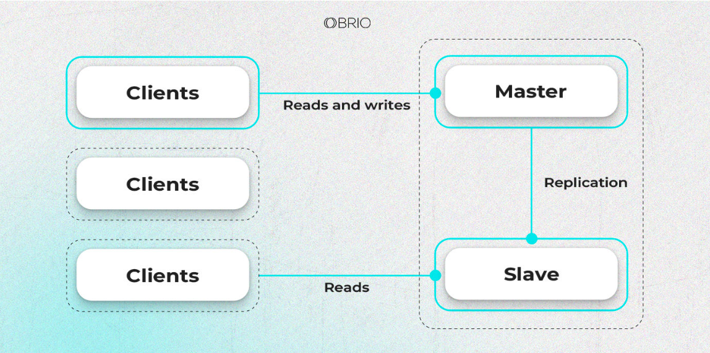

# Методи масштабування реляційних баз даних

Масштабування реляційних баз даних грає важливу роль у забезпеченні продуктивності та доступності систем з великою навантаженістю. Існує кілька підходів до цього: реплікація Master/Slave та Master/Master, функціональне та горизонтальне партиціювання, шардинг, денормалізація. У цій статі я хочу Вам розповісти про переваги та недоліки кожного цього підходу. Також розповім нюанси та наведу кейси використання, коли вони будуть працювати якнайкраще.

## Реплікація 

Реплікація в базі даних - це процес створення та підтримки копій даних з одного джерела на інших місцях. Це може бути корисним для забезпечення високої доступності та підвищення продуктивності. Існують різні види реплікації, такі як Master/Slave (одне головне джерело, багато копій), Master/Master (декілька джерел, які можуть приймати та змінювати дані), та інші.

### Master/Slave

Метод Master/Slave в контексті баз даних передбачає існування одного головного джерела (Master), яке має основний набір даних, і кількох слуг (Slave), які мають копії цих даних і синхронізуються з мастером. Мастер відповідає за запис даних, тоді як слейви використовуються для читання або резервних копій. Цей підхід може полегшити навантаження на мастера, оскільки читання можна розподілити між кількома слейвами. Проте, це також може виникнути питання синхронізації між мастером і слейвами, а також управлінням конфліктами даних у випадку одночасних змін.

Уявіть магазин електроніки з онлайн-магазином та фізичними магазинами. Основна база даних знаходиться в центральному офісі (Master), але дані про товари, клієнтів, замовлення та запаси потрібні і в фізичних магазинах. Кожен магазин може мати свою локальну копію цих даних (Slave), які регулярно синхронізуються з центральною базою.

Коли клієнт робить покупку в онлайн-магазині, дані про замовлення зберігаються у центральній базі даних (Master), а фізичні магазини можуть отримати цю інформацію через синхронізацію зі слейвами. Таким чином, клієнти можуть перевірити наявність товару в найближчому магазині, оскільки дані про запаси також синхронізуються між магазинами та центральною базою.

Це дозволяє магазинам оперативно взаємодіяти зі своїми клієнтами та мається на увазі, що зміни, які відбуваються в будь-якому місці (онлайн чи фізичний магазин), відображаються в центральній базі даних та інших місцях завдяки реплікації Master/Slave.

|  Переваги   |   Недоліки  |
| ----------- | ----------- |
| вузол Slave може служити для резервного копіювання і не впливатиме на інші сервери.| вузол Slave може служити для резервного копіювання і не впливатиме на інші сервери.   |
| Ячейка 3    | Ячейка 4   |
| Ячейка 3    | Ячейка 4   |
| Ячейка 3    | Ячейка 4   |
| Ячейка 3    | Ячейка 4   |
| Ячейка 3    | Ячейка 4   |
| Ячейка 3    | Ячейка 4   |

